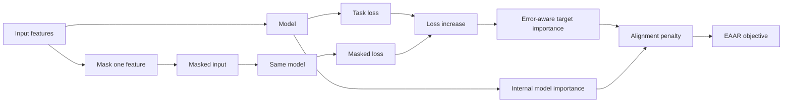
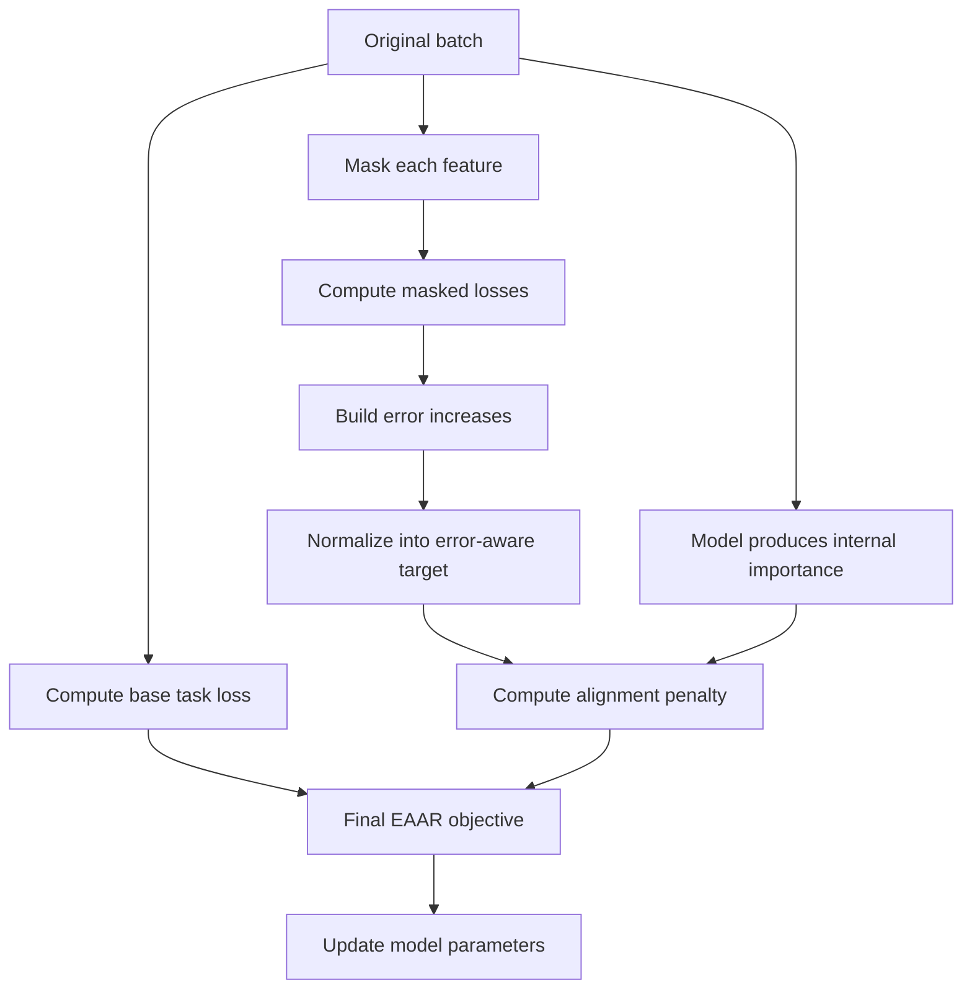
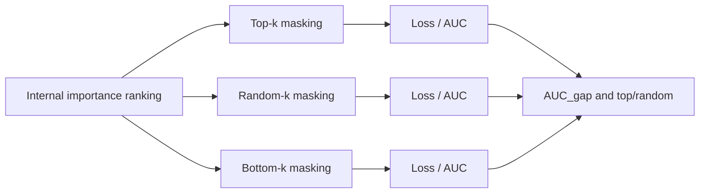

# EAAR Regularization

<p align="center">
  <b>Error-Aware Attribution Regularization for interpretable learning</b><br>
  Training-time regularization for aligning internal feature importance with error increase under feature masking.
</p>

<p align="center">
  
  
  
  
</p>

---

## Overview

EAAR, or Error-Aware Attribution Regularization, is a training-time method for shaping internal model importance so that it better reflects the actual effect of features on the task loss.

In many models, internal feature rankings look reasonable, yet the highest-ranked features do not always produce the strongest degradation when they are masked. EAAR addresses this mismatch by constructing an error-aware target importance distribution and aligning the model's internal importance with it during training.

The current repository contains the experimental, evaluation, and reporting pipeline for EAAR in supervised tabular settings, with the main focus on ANFIS and MLP models.

---

## Intuition

The central idea is simple. If masking a feature causes a strong increase in loss, that feature should receive a high target importance. If masking hardly changes the loss, the feature should not dominate the internal attribution ranking.

<p align="center"><b>Desired behavior of EAAR</b></p>



---

## Method

The EAAR objective combines the task loss with an attribution-alignment term.

```math
\mathcal{L}_{\mathrm{EAAR}}(\theta)
=
\mathcal{L}_{\mathrm{task}}(\theta)
+
\gamma
D\!\left(
p_{\theta},
q_{\mathrm{err}}
\right) .
```

Here, `L_task` is the main predictive loss, `p_theta` is the internal feature-importance distribution produced by the model, `q_err` is the target importance distribution derived from masking-induced error increase, `D` is a discrepancy measure, and `gamma` is the regularization strength.

For each feature `j`, the masking-response score is defined as

```math
\eta_j
=
\left[
\mathcal{L}_{\mathrm{task}}
\!\left(
y,
f_{\theta}(x^{(-j)})
\right)
-
\mathcal{L}_{\mathrm{task}}
\!\left(
y,
f_{\theta}(x)
\right)
\right]_+ .
```

The resulting target distribution is obtained by normalization:

```math
q_{\mathrm{err},j}
=
\frac{
\eta_j
}{
\sum_{k=1}^{d}\eta_k+\varepsilon
} .
```

The internal importance distribution is written as

```math
p_{\theta,j}
=
\frac{
a_j(\theta)
}{
\sum_{k=1}^{d}a_k(\theta)+\varepsilon
},
\qquad
a_j(\theta)\geq 0 .
```

In this repository, `q_err` is constructed as a **detached target**. The masking-response target is computed without backpropagation through its construction path. The model is therefore trained to align with the target, rather than optimized through the masking graph itself.

---

## Training Logic



---

## Repository Layout

```text
src/
scripts/
configs/
data/
results/
train.py
requirements.txt
CITATION.cff
```

The `src/` directory contains the model and regularization internals. The `scripts/` directory contains orchestration and reporting tools. The `configs/` directory stores experiment configurations. The `data/` directory is used for datasets and prepared tables. The `results/` directory stores lightweight summaries and generated reports.

---

## Experimental Scope

This repository is designed around a clear and limited claim. EAAR is intended to improve the functional faithfulness of internal attribution in the tested ANFIS and MLP settings. It is not presented as a general-purpose accuracy booster, and it does not replace external post-hoc diagnostics such as permutation importance, SAGE, ROAR, or KAR-style retraining checks.

The current experimental line covers the following settings.

| Setting | Role in the repository |
|---|---|
| ANFIS + SML2010 | Main experimental line |
| MLP + SML2010 | Portability in regression |
| MLP + Covertype | Portability in classification |
| SAGE / ROAR-lite / ablations | Boundary and mechanism checks |

---

## Setup

Create the environment, activate it, and install the dependencies.

```bash
python -m venv .venv
source .venv/bin/activate
pip install -r requirements.txt
```

---

## Main Workflows

### Main ANFIS EAAR run

```bash
python train.py \
  --config configs/config_sml2010_ea_minimal.yaml \
  --tag sml2010_eaar_main
```

### MLP regression portability

```bash
python scripts/run_mlp_eaar_multiseed.py \
  --config configs/config_sml2010_mlp_ea.yaml \
  --seeds 42,43,44,45,46
```

### MLP classification portability

```bash
python scripts/run_mlp_classifier_eaar_multiseed.py \
  --config configs/config_covtype_mlp_eaar.yaml \
  --seeds 42,43,44,45,46
```

### Explainability aggregation

```bash
python scripts/report_explainability_multiseed.py \
  --multiseed results/<multiseed_json>.json \
  --out results/<explainability_report>.json
```

### Statistical comparison

```bash
python scripts/report_significance.py \
  --a results/<run_a>.json \
  --b results/<run_b>.json \
  --metric auc_gap
```

---

## Evaluation

The central evaluation idea is deletion-style functional faithfulness. Features are ranked by importance, then top-ranked, random, and bottom-ranked features are masked. A faithful ranking should show stronger degradation for top-ranked features than for bottom-ranked ones.

The main diagnostic quantity is

```math
\mathrm{AUC}_{\mathrm{gap}}
=
\mathrm{AUC}_{\mathrm{top}}
-
\mathrm{AUC}_{\mathrm{bottom}} .
```

An additional practical diagnostic is the top-to-random ratio:

```math
R_{\mathrm{top/random}}
=
\frac{
\mathrm{AUC}_{\mathrm{top}}
}{
\mathrm{AUC}_{\mathrm{random}}+\varepsilon
} .
```

<p align="center"><b>Evaluation concept</b></p>



---

## Result Packs

The repository includes lightweight result packs and manifests for article preparation and reproducibility tracking. Key examples include:

- `results/q1_master_summary_20260503.md`
- `results/article_onefile_q1_20260503.md`
- `results/eaar_tisu_final_results_pack_20260504.md`
- `results/q1q2_final_pack_20260504.md`
- `results/results_manifest.json`

These files summarize experiments, statistics, and report outputs without storing heavy artifacts directly in version control.

---

## Reproducibility

Reproducibility is supported through fixed seeds, versioned configuration files, explicit reporting scripts, and structured result manifests. Multiseed workflows are intended to be run from saved configs, and their outputs can be aggregated into compact summary reports for explainability and statistical comparison.

Heavy artifacts such as checkpoints, arrays, figures, PDF reports, and archives should remain outside version control.

---

## Limitations

The repository intentionally makes its boundaries explicit. The final policy can behave differently from the internal-only EAAR mode when predictive quality protection competes with attribution faithfulness. Some ablations suggest that the effect of `q_err` may remain partially entangled with sparsity or compactness of the learned importance distribution. Stronger ROAR/KAR-style validation and broader SAGE coverage are still useful for stronger international claims.

These limitations are documented to keep the claim scope honest and reproducible.

---

## Citation

Citation metadata is provided in `CITATION.cff`.

Repository URL:

```text
https://github.com/lebedeffson/eaar-regularization
```

---
